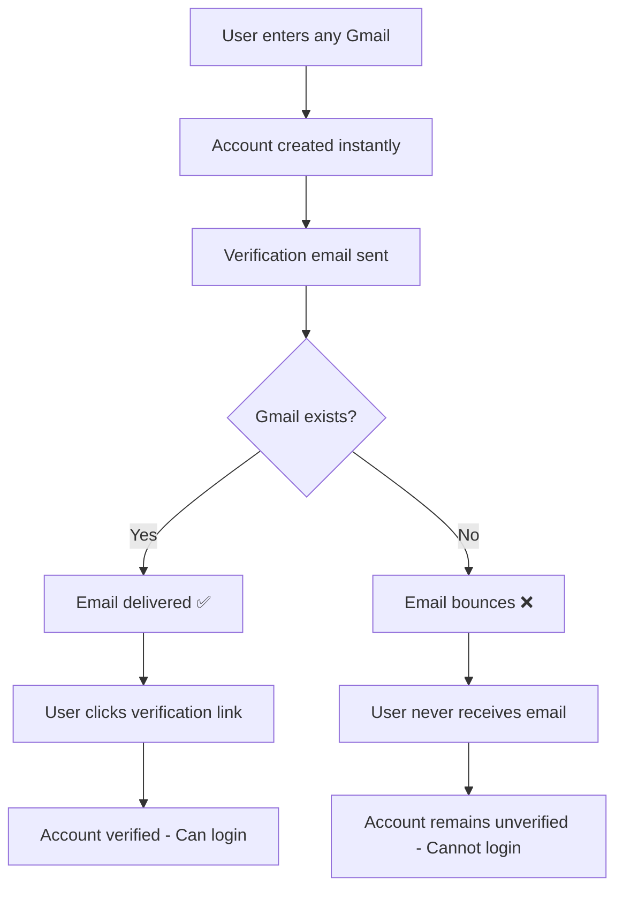

# Professional Email Verification - Updated Approach

## 🎯 **New Verification Strategy**

Instead of blocking account creation based on Gmail address patterns, we now use **email delivery verification** to confirm Gmail ownership. This is more user-friendly and follows industry best practices.

## 🔄 **How It Works Now**

### **1. Account Creation (Permissive)**
- ✅ **Allow any Gmail format** (`anything@gmail.com`)
- ✅ **Create account immediately** with `emailVerified: false`
- ✅ **No blocking** of accounts during signup

### **2. Email Verification (The Real Test)**
- 📧 **Send verification email** to the provided Gmail address
- 🎯 **Email delivery success/failure** determines if Gmail is real
- ✅ **Only real Gmail owners** can receive and click verification links

### **3. Login Protection**
- 🚫 **Block login** until email is verified
- 📧 **Provide resend verification** option
- ✅ **Clear feedback** about verification status

## 📊 **User Flow**



## ✅ **Benefits of This Approach**

### **User Experience**
- **No frustrating blocks** during signup
- **Clear verification process** users understand
- **Helpful error messages** when verification fails
- **Easy resend** verification emails

### **Security**
- **Proves email ownership** through actual email delivery
- **Natural fraud prevention** - fake emails can't receive verification
- **Industry standard** verification method
- **No false positives** from pattern matching

### **Technical**
- **Simpler logic** - no complex pattern detection needed
- **Reliable verification** through email service
- **Better error handling** with clear user feedback
- **Scalable approach** that works with any email provider

## 🧪 **Testing the New System**

### **Test Cases**

1. **Real Gmail Address**
   - ✅ Account created
   - ✅ Verification email delivered
   - ✅ User can verify and login

2. **Fake Gmail Address**
   - ✅ Account created (no blocking)
   - ❌ Verification email bounces/not delivered
   - ❌ User cannot verify or login

3. **Typo in Gmail Address**
   - ✅ Account created
   - ❌ Email goes to wrong address or bounces
   - ✅ User realizes mistake and can create new account

### **Live Testing**
1. Go to `/signup` and create account with any Gmail
2. Check if verification email arrives
3. Try logging in before verification (should be blocked)
4. Click verification link
5. Try logging in after verification (should work)

## 🔧 **Implementation Details**

### **Account Creation**
```typescript
// Only basic format check - no blocking
if (!email.endsWith('@gmail.com')) {
  return error('Only Gmail addresses are supported')
}

// Create account with emailVerified: false
const user = await createUser({
  ...userData,
  emailVerified: false
})
```

### **Login Protection**
```typescript
// Check verification status during login
if (!user.emailVerified) {
  return error('Please verify your email before logging in')
}
```

### **Verification Process**
```typescript
// Send verification email and let delivery determine validity
await sendVerificationEmail(email, verificationToken)
// If Gmail doesn't exist, email won't be delivered
// Only real Gmail owners can complete verification
```

## 📈 **Advantages Over Previous Approach**

| Previous (Blocking) | New (Email Verification) |
|-------------------|------------------------|
| ❌ Blocked legitimate users | ✅ Allows all users to try |
| ❌ Complex pattern matching | ✅ Simple email delivery test |
| ❌ False positives possible | ✅ Accurate via actual delivery |
| ❌ Frustrating user experience | ✅ Clear, expected process |
| ❌ Required Gmail API calls | ✅ Uses existing email service |

## 🎉 **Result**

This approach provides:
- **Better user experience** - no unexpected blocks
- **Reliable verification** - actual email delivery
- **Industry standard** - what users expect
- **Simple implementation** - less complex code
- **Natural fraud prevention** - fake emails can't verify

The system now **trusts but verifies** - we allow account creation but require proof of email ownership through the verification process! 🚀