# Electrotrack System Architecture - Medium

## Balanced E-commerce Architecture

---

## 1. System Overview

### PlantUML - Compact Architecture
**Paste this code in: https://www.plantuml.com/plantuml/uml/**

## 2. Component Architecture

### Mermaid - Compact Component View

```mermaid
graph TB
    %% Users
    Customer[👤 Customer]
    Admin[👨‍💼 Admin]
    
    %% Frontend
    subgraph "Next.js App"
        HomePage[🏠 Home]
        AuthPage[🔐 Login]
        CartPage[🛒 Cart]
        PaymentPage[💳 Payment]
        AdminPanel[⚙️ Admin]
        
        Components[🎨 Components]
        StateHooks[🔄 State & Hooks]
    end
    
    %% Backend
    subgraph "API Routes"
        AuthAPI[🔐 Auth API]
        BusinessAPI[📦 Business API]
        PaymentAPI[💳 Payment API]
        AdminAPI[⚙️ Admin API]
    end
    
    %% Database
    subgraph "MongoDB"
        UsersDB[(👥 Users)]
        OrdersDB[(📋 Orders)]
        TransactionsDB[(💰 Transactions)]
    end
    
    %% External
    Razorpay[💳 Razorpay]
    GoogleMaps[🗺️ Maps]
    Email[📧 Email]
    
    %% Connections
    Customer --> HomePage
    Customer --> AuthPage
    Customer --> CartPage
    Customer --> PaymentPage
    Admin --> AdminPanel
    
    HomePage --> Components
    AuthPage --> StateHooks
    CartPage --> Components
    
    AuthPage --> AuthAPI
    CartPage --> BusinessAPI
    PaymentPage --> PaymentAPI
    AdminPanel --> AdminAPI
    
    AuthAPI --> UsersDB
    BusinessAPI --> OrdersDB
    PaymentAPI --> TransactionsDB
    AdminAPI --> TransactionsDB
    
    PaymentAPI --> Razorpay
    BusinessAPI --> GoogleMaps
    AuthAPI --> Email
    
    %% Styling
    classDef frontend fill:#e3f2fd,stroke:#1976d2,stroke-width:2px
    classDef api fill:#fff3e0,stroke:#f57c00,stroke-width:2px
    classDef database fill:#e8f5e8,stroke:#2e7d32,stroke-width:2px
    classDef external fill:#f3e5f5,stroke:#7b1fa2,stroke-width:2px
    
    class HomePage,AuthPage,CartPage,PaymentPage,AdminPanel,Components,StateHooks frontend
    class AuthAPI,BusinessAPI,PaymentAPI,AdminAPI api
    class UsersDB,OrdersDB,TransactionsDB database
    class Razorpay,GoogleMaps,Email external
```

## 3. Data Flow

### PlantUML - Simple Data Flow

## 4. Technology Stack

### Mermaid - Simple Tech Stack

```mermaid
graph LR
    subgraph "Frontend"
        NextJS[Next.js 15.2.4]
        React[React + TypeScript]
        Tailwind[Tailwind CSS]
    end
    
    subgraph "Backend"
        API[API Routes]
        JWT[JWT Auth]
    end
    
    subgraph "Database"
        MongoDB[(MongoDB)]
    end
    
    subgraph "External"
        Razorpay[💳 Razorpay]
        Maps[🗺️ Google Maps]
        Email[📧 Email]
    end
    
    %% Connections
    NextJS --> API
    API --> MongoDB
    API --> Razorpay
    React --> Maps
    JWT --> Email
    
    %% Styling
    classDef frontend fill:#e3f2fd,stroke:#1976d2,stroke-width:2px
    classDef backend fill:#fff3e0,stroke:#f57c00,stroke-width:2px
    classDef database fill:#e8f5e8,stroke:#2e7d32,stroke-width:2px
    classDef external fill:#f3e5f5,stroke:#7b1fa2,stroke-width:2px
    
    class NextJS,React,Tailwind frontend
    class API,JWT backend
    class MongoDB database
    class Razorpay,Maps,Email external
```

---

## Architecture Summary

### 🏗️ **Core Stack**
- **Frontend**: Next.js 15.2.4, React, TypeScript, Tailwind CSS
- **Backend**: API Routes, JWT Authentication
- **Database**: MongoDB (Users, Orders, Transactions)
- **External**: Razorpay (Payments), Google Maps (Location), Email (Notifications)

### 🔧 **Key Features**
- User authentication & profiles
- Shopping cart & checkout
- Payment processing (Razorpay + COD)
- Admin dashboard & analytics
- Order management & tracking

### 🛡️ **Security**
- JWT authentication
- Input validation
- Secure API endpoints

This compact architecture shows the essential components of your Electrotrack e-commerce system - perfect for quick presentations! 🎯
