# Electrotrack System Architecture - Professional Edition

## Enterprise-Grade E-commerce Architecture

---

## 1. High-Level System Architecture

### PlantUML - Professional Architecture Design
**Paste this code in: https://www.plantuml.com/plantuml/uml/**

```plantuml
@startuml Electrotrack_Professional_Architecture

!theme cerulean-outline
skinparam backgroundColor #FAFAFA
skinparam shadowing false

skinparam rectangle {
    BackgroundColor White
    BorderColor #2563EB
    BorderThickness 2
    FontColor #1E40AF
    FontSize 11
}

skinparam cloud {
    BackgroundColor #EFF6FF
    BorderColor #3B82F6
    BorderThickness 2
    FontColor #1D4ED8
}

skinparam database {
    BackgroundColor #F0FDF4
    BorderColor #10B981
    BorderThickness 2
    FontColor #047857
}

skinparam package {
    BackgroundColor #F8FAFC
    BorderColor #64748B
    BorderThickness 1
    FontColor #334155
}

title <size:16><b>Electrotrack E-commerce System Architecture</b></size>

' Users
actor "<size:12><b>Customer</b></size>\n<size:10>End Users</size>" as customer #FFE4E1
actor "<size:12><b>Admin</b></size>\n<size:10>System Admin</size>" as admin #E0F2FE

' Presentation Layer
package "<size:14><b>Presentation Layer</b></size>" as presentation #F0F9FF {
    rectangle "<size:13><b>Next.js 15.2.4 Application</b></size>" as nextapp #FFFFFF {
        rectangle "<b>Client Pages</b>\n• Home & Product Catalog\n• User Authentication\n• Shopping Cart & Checkout\n• Payment Gateway\n• User Dashboard" as clientPages
        
        rectangle "<b>Admin Interface</b>\n• Admin Dashboard\n• Analytics & Reports\n• Transaction Management\n• User Management\n• System Configuration" as adminInterface
        
        rectangle "<b>UI Components</b>\n• Reusable Components\n• Form Validations\n• Navigation & Layout\n• Responsive Design\n• Accessibility Features" as uiComponents
    }
}

' Application Layer
package "<size:14><b>Application Layer</b></size>" as application #FFF7ED {
    rectangle "<size:13><b>Next.js API Routes</b></size>" as apiLayer #FFFFFF {
        rectangle "<b>Authentication APIs</b>\n• User Login/Register\n• JWT Token Management\n• Session Handling\n• Password Reset" as authAPIs
        
        rectangle "<b>Business APIs</b>\n• Product Management\n• Order Processing\n• Cart Operations\n• User Profile APIs" as businessAPIs
        
        rectangle "<b>Payment APIs</b>\n• Razorpay Integration\n• Transaction Processing\n• Payment Validation\n• Webhook Handling" as paymentAPIs
        
        rectangle "<b>Admin APIs</b>\n• Analytics Generation\n• User Management\n• System Configuration\n• Report Generation" as adminAPIs
    }
    
    rectangle "<size:13><b>Business Logic Layer</b></size>" as businessLogic #FFFFFF {
        rectangle "<b>Core Services</b>\n• Authentication Service\n• Authorization Service\n• Data Validation\n• Error Handling" as coreServices
        
        rectangle "<b>Domain Services</b>\n• Order Management\n• Payment Processing\n• Inventory Management\n• Notification Service" as domainServices
    }
}

' Data Layer
package "<size:14><b>Data Layer</b></size>" as dataLayer #F0FDF4 {
    database "<size:13><b>MongoDB Database</b></size>" as mongodb #FFFFFF {
        rectangle "<b>User Data</b>\n• User Profiles\n• Authentication Info\n• Preferences\n• Activity Logs" as userData
        
        rectangle "<b>Business Data</b>\n• Product Catalog\n• Order Records\n• Transaction History\n• Inventory Data" as businessData
        
        rectangle "<b>System Data</b>\n• Configuration\n• Audit Logs\n• Analytics Data\n• Cache Data" as systemData
    }
    
    rectangle "<size:13><b>Data Access Layer</b></size>" as dataAccess #FFFFFF {
        rectangle "<b>Database Operations</b>\n• Connection Management\n• Query Optimization\n• Transaction Management\n• Data Caching" as dbOps
        
        rectangle "<b>Data Models</b>\n• User Models\n• Order Models\n• Payment Models\n• Product Models" as dataModels
    }
}

' External Services
package "<size:14><b>External Services</b></size>" as external #FDF2F8 {
    cloud "<size:12><b>Razorpay</b></size>\n<size:10>Payment Gateway</size>\n• Online Payments\n• Transaction Processing\n• Payment Security\n• Webhook Integration" as razorpay #FEF7FF
    
    cloud "<size:12><b>Google Maps</b></size>\n<size:10>Location Services</size>\n• Address Validation\n• Location Tracking\n• Delivery Optimization\n• Geolocation APIs" as googlemaps #F0FDF4
    
    cloud "<size:12><b>Email Service</b></size>\n<size:10>Communication</size>\n• Order Confirmations\n• Password Reset\n• Promotional Emails\n• System Notifications" as emailService #FFF7ED
}

' User Interactions
customer --> nextapp : <b>Browse & Purchase</b>
admin --> nextapp : <b>System Management</b>

' Presentation to Application
nextapp --> apiLayer : <b>API Requests</b>
clientPages --> authAPIs : Authentication
clientPages --> businessAPIs : Business Operations
clientPages --> paymentAPIs : Payment Processing
adminInterface --> adminAPIs : Admin Operations
uiComponents --> authAPIs : Form Submissions

' Application Layer Interactions
apiLayer --> businessLogic : <b>Business Processing</b>
authAPIs --> coreServices : Authentication Logic
businessAPIs --> domainServices : Business Logic
paymentAPIs --> domainServices : Payment Logic
adminAPIs --> domainServices : Admin Logic

' Business Logic to Data
businessLogic --> dataAccess : <b>Data Operations</b>
coreServices --> dbOps : Database Operations
domainServices --> dbOps : Business Data Access
dataAccess --> mongodb : <b>Database Queries</b>
dbOps --> userData : User Operations
dbOps --> businessData : Business Operations
dbOps --> systemData : System Operations

' External Service Integrations
domainServices --> razorpay : <b>Payment Processing</b>
nextapp --> googlemaps : <b>Location Services</b>
domainServices --> emailService : <b>Email Notifications</b>

note right of nextapp
  <b>Frontend Technology Stack:</b>
  • React 18 with TypeScript
  • Tailwind CSS + Shadcn/UI
  • Server-Side Rendering
  • Progressive Web App
  • Mobile Responsive Design
end note

note bottom of mongodb
  <b>Database Features:</b>
  • Document-based Storage
  • Horizontal Scaling
  • Real-time Analytics
  • Automated Backups
  • Performance Indexing
end note

note left of razorpay
  <b>Payment Security:</b>
  • PCI DSS Compliance
  • 256-bit SSL Encryption
  • Fraud Detection
  • Multi-currency Support
  • Instant Settlements
end note

@enduml
```

---

## 2. Advanced Component Architecture

### Mermaid - Enterprise Component Design

```mermaid
graph TB
    %% Define custom styles for better visual hierarchy
    classDef userActor fill:#FFE4E1,stroke:#DC2626,stroke-width:3px,color:#7F1D1D
    classDef adminActor fill:#E0F2FE,stroke:#0284C7,stroke-width:3px,color:#0C4A6E
    classDef frontend fill:#EFF6FF,stroke:#2563EB,stroke-width:2px,color:#1E40AF
    classDef api fill:#FFF7ED,stroke:#EA580C,stroke-width:2px,color:#C2410C
    classDef service fill:#F0FDF4,stroke:#16A34A,stroke-width:2px,color:#15803D
    classDef database fill:#FFFBEB,stroke:#D97706,stroke-width:2px,color:#92400E
    classDef external fill:#FDF2F8,stroke:#C026D3,stroke-width:2px,color:#A21CAF
    
    %% Actors
    Customer[👤 Customer<br/>End User]
    Admin[👨‍💼 System Admin<br/>Management]
    
    %% Frontend Architecture
    subgraph "Frontend Layer - Next.js 15.2.4"
        direction TB
        
        subgraph "User Experience"
            HomePage[🏠 Home & Catalog<br/>Product Discovery]
            AuthPages[🔐 Authentication<br/>Login/Register]
            ShoppingFlow[🛒 Shopping<br/>Cart/Checkout/Payment]
            UserDashboard[📊 User Dashboard<br/>Orders/Profile]
        end
        
        subgraph "Admin Interface"
            AdminDashboard[📈 Admin Dashboard<br/>Analytics & KPIs]
            UserMgmt[👥 User Management<br/>CRUD Operations]
            TransactionMgmt[💰 Transaction Center<br/>Payment Analytics]
            SystemConfig[⚙️ System Config<br/>Settings]
        end
        
        subgraph "Component Library"
            UIComponents[🎨 UI Components<br/>Reusable Elements]
            FormComponents[📝 Form System<br/>Validation]
            NavigationSystem[🧭 Navigation<br/>Routing]
            NotificationSystem[📢 Notifications<br/>Alerts]
        end
        
        subgraph "State Management"
            AuthContext[🔑 Auth Context<br/>User State]
            CartContext[🛍️ Cart Context<br/>Shopping State]
            AdminContext[👨‍💼 Admin Context<br/>Management]
        end
    end
    
    %% API Gateway Architecture
    subgraph "API Services"
        direction TB
        
        subgraph "Authentication"
            AuthService[🔐 Auth API<br/>JWT & Sessions]
            UserService[👤 User API<br/>Profile Management]
            SecurityService[🔒 Security API<br/>Password & Auth]
        end
        
        subgraph "Business Logic"
            ProductService[📦 Product API<br/>Catalog Management]
            OrderService[📋 Order API<br/>Processing]
            CartService[🛒 Cart API<br/>Session Management]
        end
        
        subgraph "Payment Services"
            PaymentGateway[💳 Payment API<br/>Razorpay Integration]
            TransactionService[💰 Transaction API<br/>Processing]
            WebhookService[🔗 Webhook API<br/>External Events]
        end
        
        subgraph "Admin Services"
            AnalyticsService[📊 Analytics API<br/>Data Processing]
            AdminService[⚙️ Admin API<br/>System Management]
            AuditService[📋 Audit API<br/>Compliance]
        end
    end
    
    %% Data Architecture
    subgraph "Data Layer - MongoDB"
        direction TB
        
        subgraph "Core Collections"
            UsersCollection[(👥 Users<br/>Profiles & Auth)]
            ProductsCollection[(📦 Products<br/>Catalog)]
            OrdersCollection[(📋 Orders<br/>Transactions)]
            PaymentsCollection[(💳 Payments<br/>Financial)]
        end
        
        subgraph "System Collections"
            AnalyticsCollection[(📊 Analytics<br/>BI Data)]
            AuditCollection[(📋 Audit<br/>Security)]
            SessionCollection[(🔐 Sessions<br/>User State)]
        end
        
        subgraph "Data Services"
            DBConnector[🔌 DB Connector<br/>Connection Pool]
            QueryOptimizer[⚡ Optimizer<br/>Performance]
            DataValidator[✅ Validator<br/>Schema Check]
        end
    end
    
    %% External Services
    subgraph "External Integrations"
        RazorpayGateway[💳 Razorpay<br/>Payment Gateway]
        GoogleMapsAPI[🗺️ Google Maps<br/>Location Services]
        EmailService[📧 Email<br/>Communications]
        SMSService[📱 SMS<br/>Notifications]
    end
    
    %% User Flow
    Customer --> HomePage
    Customer --> AuthPages
    Customer --> ShoppingFlow
    Customer --> UserDashboard
    
    Admin --> AdminDashboard
    Admin --> UserMgmt
    Admin --> TransactionMgmt
    Admin --> SystemConfig
    
    %% Component Connections
    HomePage --> UIComponents
    AuthPages --> FormComponents
    ShoppingFlow --> NotificationSystem
    UserDashboard --> NavigationSystem
    
    AuthPages --> AuthContext
    ShoppingFlow --> CartContext
    AdminDashboard --> AdminContext
    
    %% API Connections
    AuthContext --> AuthService
    CartContext --> CartService
    ShoppingFlow --> OrderService
    HomePage --> ProductService
    UserDashboard --> UserService
    
    AdminContext --> AdminService
    AdminDashboard --> AnalyticsService
    TransactionMgmt --> TransactionService
    
    %% Service Connections
    AuthService --> UserService
    OrderService --> CartService
    PaymentGateway --> TransactionService
    AnalyticsService --> AdminService
    
    %% Database Connections
    AuthService --> UsersCollection
    ProductService --> ProductsCollection
    OrderService --> OrdersCollection
    TransactionService --> PaymentsCollection
    
    AnalyticsService --> AnalyticsCollection
    AuditService --> AuditCollection
    AuthService --> SessionCollection
    
    UsersCollection --> DBConnector
    ProductsCollection --> QueryOptimizer
    OrdersCollection --> DataValidator
    
    %% External Connections
    PaymentGateway --> RazorpayGateway
    TransactionService --> RazorpayGateway
    OrderService --> GoogleMapsAPI
    UserService --> EmailService
    AuthService --> SMSService
    
    %% Apply Styles
    class Customer userActor
    class Admin adminActor
    class HomePage,AuthPages,ShoppingFlow,UserDashboard,AdminDashboard,UserMgmt,TransactionMgmt,SystemConfig,UIComponents,FormComponents,NavigationSystem,NotificationSystem,AuthContext,CartContext,AdminContext frontend
    class AuthService,UserService,SecurityService,ProductService,OrderService,CartService,PaymentGateway,TransactionService,WebhookService,AnalyticsService,AdminService,AuditService api
    class DBConnector,QueryOptimizer,DataValidator service
    class UsersCollection,ProductsCollection,OrdersCollection,PaymentsCollection,AnalyticsCollection,AuditCollection,SessionCollection database
    class RazorpayGateway,GoogleMapsAPI,EmailService,SMSService external
```

---

## 3. Advanced Data Flow Architecture

### PlantUML - Enterprise Data Flow

---

## 4. Security & Performance Architecture

### PlantUML - Security Layers

---

## 5. Enterprise Architecture Summary

### 🏗️ **Professional Technology Stack**
- **Frontend**: Next.js 15.2.4, React 18, TypeScript, Tailwind CSS, Shadcn/UI
- **Backend**: Next.js API Routes, Server Actions, Middleware, JWT Authentication  
- **Database**: MongoDB with advanced indexing, connection pooling, real-time analytics
- **External Services**: Razorpay (Payments), Google Maps (Location), Email/SMS (Communications)
- **Security**: Multi-layer security, HTTPS, JWT, rate limiting, data encryption
- **Performance**: SSR/SSG, code splitting, caching strategy, CDN integration

### 🔧 **Enterprise Features**
- **User Experience**: Advanced authentication, personalized shopping, order tracking
- **Admin Operations**: Real-time analytics, user management, transaction monitoring
- **Payment Processing**: Secure Razorpay integration, COD support, fraud detection
- **Location Services**: Address validation, delivery optimization, geolocation
- **Communication**: Automated notifications, order confirmations, promotional emails
- **Analytics**: Business intelligence, real-time reporting, performance monitoring

### 🛡️ **Security & Compliance**
- **Multi-layer Security**: Frontend, API, database, and external service security
- **Authentication**: JWT-based with refresh tokens, multi-factor authentication
- **Data Protection**: Encryption at rest and in transit, secure key management
- **Compliance**: PCI DSS for payments, GDPR considerations, audit logging
- **Threat Protection**: Rate limiting, DDoS protection, fraud detection

### 📊 **Performance & Scalability**
- **Optimization**: Server-side rendering, code splitting, image optimization
- **Caching**: Multi-tier caching strategy from browser to CDN
- **Database**: Query optimization, connection pooling, automated indexing
- **Monitoring**: Real-time performance metrics, error tracking, health monitoring
- **Scalability**: Horizontal scaling ready, microservices architecture

### 🚀 **Architecture Benefits**
- **Enterprise-Ready**: Professional design patterns and best practices
- **Scalable**: Microservices architecture supporting high traffic loads
- **Secure**: Comprehensive security measures protecting user and business data
- **Performant**: Optimized for speed with advanced caching and optimization
- **Maintainable**: Clean architecture, TypeScript safety, comprehensive testing
- **User-Centric**: Responsive design, accessibility, smooth user experience

This **Professional System Architecture** provides a complete enterprise-grade solution for your Electrotrack e-commerce platform, suitable for technical presentations, stakeholder reviews, and development team guidance! 🎯
