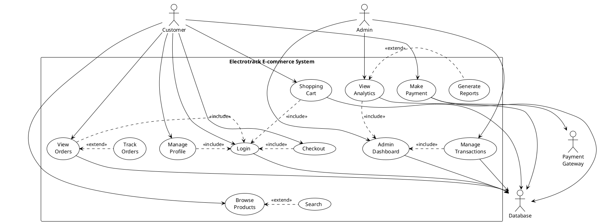
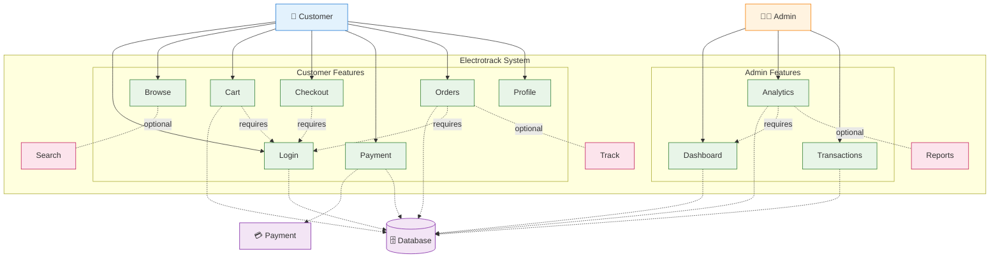

# Electrotrack E-commerce System - Use Case Diagram

# Electrotrack E-commerce System - Use Case Diagram

## PlantUML Code - Clean & Professional

### Paste this code in: **PlantUML Online Editor** (https://www.plantuml.com/plantuml/uml/)



## Compact Mermaid Version



## � **Essential Features Summary:**

### **� Customer Journey (7 Core Features):**
```
1. Login → 2. Browse Products → 3. Shopping Cart → 
4. Checkout → 5. Payment → 6. View Orders → 7. Profile
```

### **👨‍💼 Admin Operations (3 Core Features):**
```
1. Admin Dashboard → 2. Analytics → 3. Manage Transactions
```

### **� Dependencies:**
- **Cart, Checkout, Orders, Profile** → **Login Required**
- **Analytics, Transactions** → **Admin Dashboard Access**

### **⭐ Optional Enhancements:**
- Search Products, Track Orders, Generate Reports

---

## 🚀 **Quick Setup Guide:**

1. **Copy PlantUML code** → Paste in https://www.plantuml.com/plantuml/uml/
2. **Generate diagram** → Download PNG/SVG
3. **Use in presentations** → Clean, professional look

**Result:** Simple, focused use case diagram showing essential Electrotrack functionality!

## Simple Vertical Diagram (Draw.io Format)

### Paste this code in: **Draw.io** (https://app.diagrams.net) → Advanced → PlantUML

```
@startuml
top to bottom direction

actor Customer
actor Admin

rectangle System {
    (Login)
    (Browse)
    (Cart)
    (Checkout)
    (Payment)
    (Orders)
    
    (Dashboard)
    (Analytics)
    (Manage)
}

Customer --> (Login)
Customer --> (Browse)
Customer --> (Cart)
Customer --> (Checkout)
Customer --> (Payment)
Customer --> (Orders)

Admin --> (Dashboard)
Admin --> (Analytics)  
Admin --> (Manage)

@enduml
```

## Text-Based Vertical Layout (Copy-Paste Ready)

```
ELECTROTRACK USE CASE DIAGRAM (Vertical)

👤 CUSTOMER                    👨‍💼 ADMIN
    │                              │
    ├── Login/Register             ├── Admin Login
    ├── Browse Products            ├── Dashboard
    ├── Shopping Cart              ├── Analytics
    ├── Checkout                   ├── Transactions
    ├── Payment/COD                └── Reports
    └── My Orders
    
🔗 External: 💳 Razorpay Payment Gateway
```

## 📍 **Where to Paste Each Code:**

### 1. **PlantUML Online Editor** (Recommended)
- **URL:** https://www.plantuml.com/plantuml/uml/
- **Steps:**
  1. Go to the website
  2. Paste the PlantUML code in the text area
  3. Click "Submit" to generate the diagram
  4. Download as PNG/SVG/PDF

### 2. **Mermaid Live Editor**
- **URL:** https://mermaid.live
- **Steps:**
  1. Visit the website
  2. Replace existing code with the Mermaid code
  3. Diagram updates automatically
  4. Click "Actions" → "Download PNG/SVG"

### 3. **Draw.io (Diagrams.net)**
- **URL:** https://app.diagrams.net
- **Steps:**
  1. Create new diagram
  2. Go to "Advanced" → "PlantUML"
  3. Paste the simple code
  4. Export as needed

### 4. **VS Code (With Extensions)**
- **Extensions needed:**
  - PlantUML extension
  - Mermaid Preview extension
- **Steps:**
  1. Create `.puml` or `.md` file
  2. Paste the code
  3. Use Ctrl+Shift+P → "PlantUML: Preview"

## 🎯 **Use Case Description:**

### **Customer Use Cases:**
- **Primary:** Browse, Cart, Checkout, Payment, Orders
- **Secondary:** Profile, Support, Search, Tracking

### **Admin Use Cases:**
- **Management:** Dashboard, Analytics, Transactions
- **Operations:** Reports, Orders, System Config

### **System Features Covered:**
- ✅ User Authentication & Registration
- ✅ Product Browsing & Search
- ✅ Shopping Cart Management
- ✅ Dual Payment System (Online + COD)
- ✅ Order Management & Tracking
- ✅ Admin Dashboard & Analytics
- ✅ Transaction Management
- ✅ System Administration

## 🚀 **Recommended Workflow:**
1. **Use PlantUML** for professional diagrams
2. **Export as PNG** for presentations
3. **Save as SVG** for web use
4. **Keep source code** for modifications

The PlantUML version will give you the most professional-looking use case diagram for your Electrotrack system! 🎯
